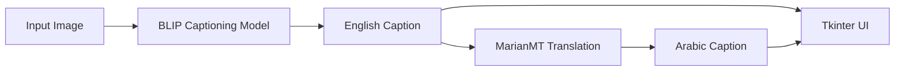

# Image Captioning + Arabic Translation

> A desktop computer-vision/NLP application that generates an English caption for an image with **BLIP**, then translates the caption into Arabic with **MarianMT**.

## What it does

1. The user selects an image through a Tkinter interface.
2. A pre-trained **BLIP** vision-language model generates an English description.
3. **MarianMT** translates the generated caption into Arabic.
4. The UI presents both outputs to the user with progress feedback.



## Why this project matters

This project connects two pre-trained transformer systems into one end-to-end application: a multimodal image-to-text stage followed by neural machine translation. It was an early project in my transition from web development into applied AI engineering and helped shape my interest in building complete AI products rather than isolated notebooks.

## Tech stack

`Python` · `PyTorch` · `Transformers` · `BLIP` · `MarianMT` · `Pillow` · `Tkinter`

## Installation

The project dependencies are listed inside the project directory.

```bash
git clone https://github.com/omarbazooka/Image-Caption-Generator-with-Arabic-Translation-.git
cd Image-Caption-Generator-with-Arabic-Translation-/"img-caption project"
pip install -r requirements.txt
```

The first model run may require downloading pre-trained model weights.

## Engineering notes

- Caption generation and translation are separated into distinct inference stages.
- The GUI keeps the model workflow accessible to non-technical users.
- The implementation uses the current **BLIP + MarianMT** pipeline; older CNN/LSTM descriptions of this project are no longer the canonical implementation.

## Possible next steps

- Move inference behind a FastAPI service.
- Add batch image processing.
- Add evaluation examples and latency measurements.
- Package the application for easier local distribution.
- Add tests around model loading, translation, and error handling.

## Author

**Omar Ahmed** — AI Engineer  
[GitHub](https://github.com/omarbazooka) · [LinkedIn](https://www.linkedin.com/in/omer-ahmed-bahaa/)
